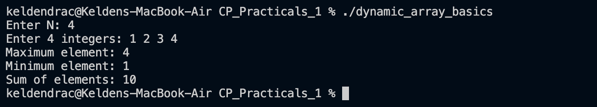
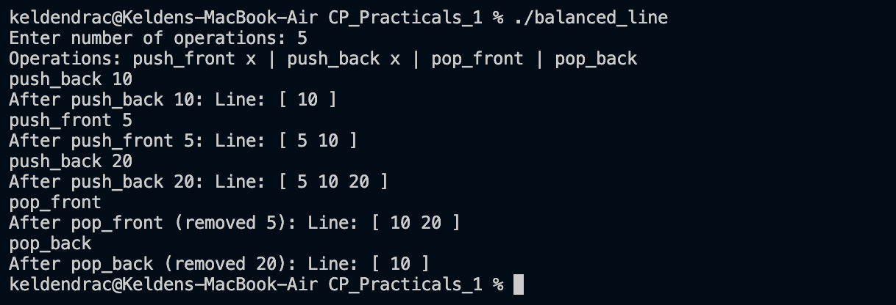
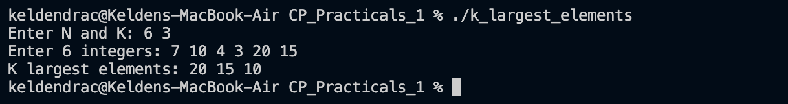
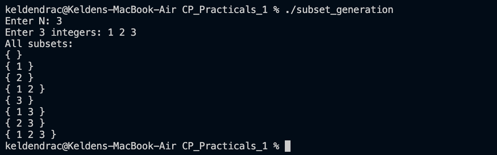
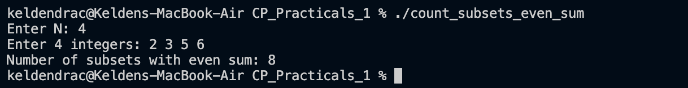
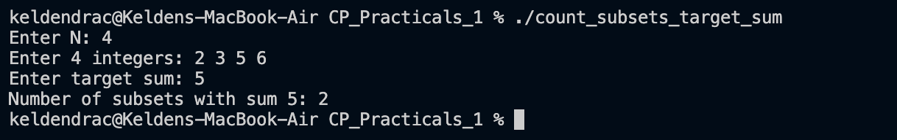

# CP Practicals 1 - Programming Problems

This folder contains solutions to 10 competitive programming problems focusing on **vectors/dynamic arrays**, **deques**, **priority queues**, and **bitmask techniques**.

## Table of Contents

1. [Dynamic Array Basics](#problem-1-dynamic-array-basics)
2. [Reverse the Array](#problem-2-reverse-the-array)
3. [Remove Duplicates](#problem-3-remove-duplicates)
4. [Sliding Window Maximum](#problem-4-sliding-window-maximum)
5. [Balanced Line Problem](#problem-5-balanced-line-problem)
6. [K Largest Elements](#problem-6-k-largest-elements)
7. [Running Median](#problem-7-running-median)
8. [Subset Generation](#problem-8-subset-generation)
9. [Count Subsets with Even Sum](#problem-9-count-subsets-with-even-sum)
10. [Count Subsets with Target Sum](#problem-10-count-subsets-with-target-sum)

---

## Problem 1: Dynamic Array Basics

**Problem Summary:**  
Read N integers, store them in a dynamic container, and print the maximum element, minimum element, and sum of all elements.

**Data Structure:** Vector  
**Screenshot:**  

**Files:** [`dynamic_array_basics.cpp`](dynamic_array_basics.cpp) | [`dynamic_array_basics_analysis.md`](dynamic_array_basics_analysis.md)

---

## Problem 2: Reverse the Array

**Problem Summary:**  
Given N integers, print the array in reverse order.

**Example:**
- Input: N=5, elements: 1 2 3 4 5
- Output: 5 4 3 2 1

**Data Structure:** Vector  
**Screenshot:**  

**Files:** [`reverse_array.cpp`](reverse_array.cpp) | [`reverse_array_analysis.md`](reverse_array_analysis.md)

---

## Problem 3: Remove Duplicates

**Problem Summary:**  
Given N integers, remove duplicates and print only unique values in sorted order.

**Example:**
- Input: N=7, elements: 1 2 2 3 4 4 5
- Output: 1 2 3 4 5

**Data Structure:** Vector  
**Screenshot:**  

**Files:** [`remove_duplicates.cpp`](remove_duplicates.cpp) | [`remove_duplicates_analysis.md`](remove_duplicates_analysis.md)

---

## Problem 4: Sliding Window Maximum

**Problem Summary:**  
Given an array of size N and window size K, print the maximum element in every sliding window of size K.

**Example:**
- Input: N=8, K=3, elements: 1 3 -1 -3 5 3 6 7
- Output: 3 3 5 5 6 7

**Data Structure:** Deque  
**Screenshot:**  

**Files:** [`sliding_window_maximum.cpp`](sliding_window_maximum.cpp) | [`sliding_window_maximum_analysis.md`](sliding_window_maximum_analysis.md)

---

## Problem 5: Balanced Line Problem

**Problem Summary:**  
Simulate a line where people can enter from the front or back, and leave from the front or back. Support four operations: `push_front`, `push_back`, `pop_front`, `pop_back`. Print the contents after each operation.

**Data Structure:** Deque  
**Screenshot:**  

**Files:** [`balanced_line.cpp`](balanced_line.cpp) | [`balanced_line_analysis.md`](balanced_line_analysis.md)

---

## Problem 6: K Largest Elements

**Problem Summary:**  
Given N numbers, print the K largest numbers in descending order.

**Example:**
- Input: N=6, K=3, elements: 7 10 4 3 20 15
- Output: 20 15 10

**Data Structure:** Priority Queue (Max Heap)  
**Screenshot:**  

**Files:** [`k_largest_elements.cpp`](k_largest_elements.cpp) | [`k_largest_elements_analysis.md`](k_largest_elements_analysis.md)

---

## Problem 7: Running Median

**Problem Summary:**  
Find the running median of a stream of numbers. After reading each number, output the median of all numbers read so far.

**Data Structure:** Priority Queue (Min Heap & Max Heap)  
**Screenshot:**  

**Files:** [`running_median.cpp`](running_median.cpp) | [`running_median_analysis.md`](running_median_analysis.md)

**Reference:** [HackerRank - Find the Running Median](https://www.hackerrank.com/challenges/find-the-running-median/problem)

---

## Problem 8: Subset Generation

**Problem Summary:**  
Given a set of N numbers, print all possible subsets (the power set).

**Example:**
- Input: N=3, elements: 1 2 3
- Output: {}, {1}, {2}, {1,2}, {3}, {1,3}, {2,3}, {1,2,3}

**Technique:** Bitmask  
**Screenshot:**  

**Files:** [`subset_generation.cpp`](subset_generation.cpp) | [`subset_generation_analysis.md`](subset_generation_analysis.md)

---

## Problem 9: Count Subsets with Even Sum

**Problem Summary:**  
Given N numbers, count how many subsets have an even sum.

**Example:**
- Input: N=3, elements: 1 2 3
- Output: 4 (subsets: {}, {1,3}, {2}, {2,1,3})

**Technique:** Bitmask  
**Screenshot:**  

**Files:** [`count_subsets_even_sum.cpp`](count_subsets_even_sum.cpp) | [`count_subsets_even_sum_analysis.md`](count_subsets_even_sum_analysis.md)

---

## Problem 10: Count Subsets with Target Sum

**Problem Summary:**  
Given N numbers and a target sum X, count how many subsets have a sum equal to X.

**Technique:** Bitmask / Dynamic Programming  
**Screenshot:**  

**Files:** [`count_subsets_target_sum.cpp`](count_subsets_target_sum.cpp) | [`count_subsets_target_sum_analysis.md`](count_subsets_target_sum_analysis.md)

**Reference:** [GeeksforGeeks - Count of Subsets with Sum Equal to X](https://www.geeksforgeeks.org/dsa/count-of-subsets-with-sum-equal-to-x/)

---

## Key Data Structures Used

1. **Vector** - Dynamic arrays (Problems 1, 2, 3)
2. **Deque** - Double-ended queues (Problems 4, 5)
3. **Priority Queue** - Heaps (Problems 6, 7)
4. **Bitmask** - Bit manipulation for subset generation (Problems 8, 9, 10)

---

## Submission Checklist

For each problem, the following files are included:
- ✅ `problem_name.cpp` - C++ solution
- ✅ `problem_name_analysis.md` - Detailed analysis with time/space complexity
- ✅ `problem_name_screenshot.png` - Program output screenshot
