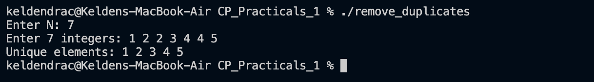

# Problem 3 — Remove Duplicates

## Problem Summary
Given N integers (possibly with duplicates), remove all duplicate values and print only the unique elements in sorted order.

## Algorithm Explanation
1. Read N integers into a `vector<int>`.
2. Sort the vector — this brings all duplicate values next to each other.
3. Apply `std::unique`, which overwrites each duplicate with the next distinct value, effectively moving all duplicates to the end. It returns an iterator pointing to the new logical end.
4. Erase from that iterator to `arr.end()` to physically remove the duplicates.
5. Print the remaining elements.

## Time Complexity
- Sorting: O(N log N)
- `std::unique` scan: O(N)
- **Overall: O(N log N)**

## Space Complexity
- In-place modification of the vector: **O(N)** (no extra containers)

## Screenshot

## Reflection
I learnt the classic `sort → unique → erase` idiom in C++. The key insight is that `std::unique` only removes *adjacent* duplicates, so sorting first is mandatory. An alternative approach would be to use `std::set`, which keeps only unique elements automatically, but using vector preserves explicit control over memory.
