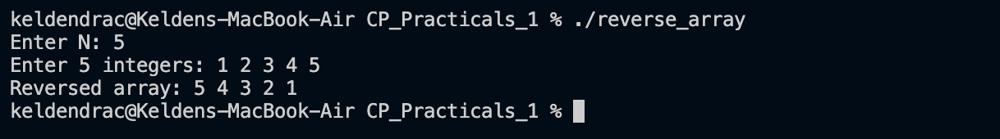

# Problem 2 — Reverse the Array

## Problem Summary
Given N integers stored in a vector, print all elements in reverse order without modifying the original array.

## Algorithm Explanation
1. Read N integers into a `vector<int>`.
2. Traverse the vector from index `N-1` down to `0`, printing each element.
3. No extra space is needed — reverse traversal is done in-place via index manipulation.

## Time Complexity
- Reading input: O(N)
- Reverse traversal for output: O(N)
- **Overall: O(N)**

## Space Complexity
- Storing the array: O(N)
- No auxiliary data structure needed for reversal: **O(N)** total

## Screenshot

## Reflection
This problem reinforced how index-based traversal of a vector works. A reverse traversal (`i = n-1` down to `0`) is a simple but important pattern. Alternatively, `std::reverse` or `rbegin`/`rend` iterators could be used, but the manual loop makes the logic explicit and easy to understand for beginners.
