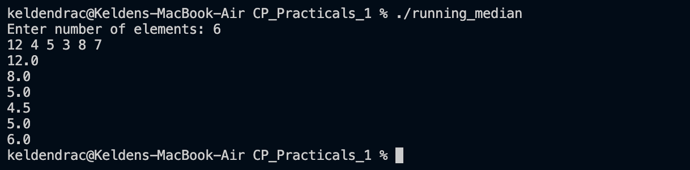

# Problem 7 — Running Median

## Problem Summary
Given a stream of N integers, after each new integer is read, compute and print the median of all integers seen so far.  
(HackerRank: https://www.hackerrank.com/challenges/find-the-running-median/problem)

## Algorithm Explanation
Two heaps are maintained simultaneously:
- **`maxHeap`** (max-heap): stores the **lower half** of all elements seen so far. The top is the largest element of the lower half.
- **`minHeap`** (min-heap): stores the **upper half** of all elements. The top is the smallest element of the upper half.

**Invariants** after each insertion:
1. `|maxHeap.size() - minHeap.size()| ≤ 1` — the heaps are always balanced.
2. `maxHeap.top() ≤ minHeap.top()` — lower half is entirely ≤ upper half.

**Steps for each new element `x`:**
1. If `x ≤ maxHeap.top()`, push to `maxHeap`; otherwise push to `minHeap`.
2. Rebalance: move the top of the larger heap to the smaller heap if their sizes differ by more than 1.
3. Compute the median:
   - Equal sizes → average of both tops (double)
   - `maxHeap` larger → `maxHeap.top()`
   - `minHeap` larger → `minHeap.top()`

## Time Complexity
- Each insertion + rebalance: O(log N)
- **Overall for N elements: O(N log N)**

## Space Complexity
- Both heaps together store all N elements: **O(N)**

## Screenshot

## Reflection
This problem was the most challenging of the set. A naive approach of sorting the array after each insertion would be O(N²). The two-heap technique is elegant — it keeps the median at the boundary between two sorted halves, making every operation O(log N). I learnt that `std::priority_queue` can act as a min-heap by passing `greater<int>` as the comparator, and that careful rebalancing after each step is the key to correctness.
