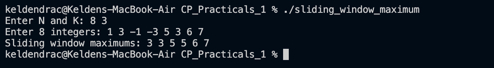

# Problem 4 — Sliding Window Maximum

## Problem Summary
Given an array of N integers and a window size K, slide a window of size K across the array from left to right and print the maximum element in each window position.

## Algorithm Explanation
1. Use a `deque<int>` that stores **array indices** (not values), maintained in a monotonically decreasing order of their corresponding array values.
2. For each new index `i`:
   - **Remove stale indices** from the front: if `dq.front() < i - k + 1`, that index is outside the current window.
   - **Remove smaller indices** from the back: if `arr[dq.back()] <= arr[i]`, those elements can never be the maximum for any future window, so discard them.
   - Push `i` to the back.
3. Once the first full window is formed (`i >= k - 1`), the front of the deque holds the index of the current window's maximum — print `arr[dq.front()]`.

## Time Complexity
- Each index is pushed once and popped at most once: **O(N)**

## Space Complexity
- Deque holds at most K indices at any time: **O(K)**

## Screenshot

## Reflection
This problem helped me understand how a deque can maintain a sliding window maximum efficiently. Initially I considered a brute-force approach of scanning each window of size K, giving O(N·K). After using the monotonic deque technique, the complexity reduced to O(N) because every element is processed (pushed and popped) at most once. The key insight is that we never need an element that is both older *and* smaller than the current element.
