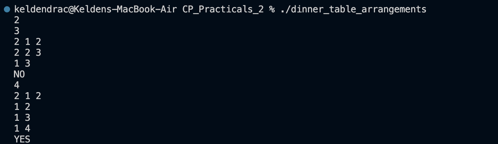
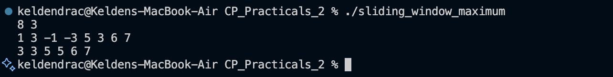
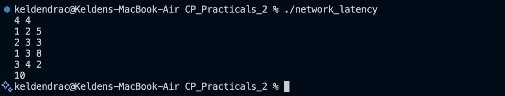
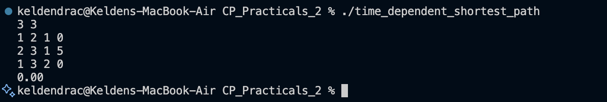
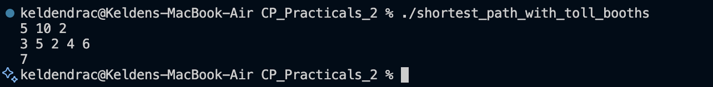

# CP Practicals 2 - Advanced Programming Problems

This folder contains solutions to 7 advanced competitive programming problems focusing on **backtracking**, **bit manipulation**, **graph algorithms**, and **state-space search**.

## Table of Contents

1. [Dinner Table Arrangements](#problem-1-dinner-table-arrangements)
2. [Maximum AND Subarray](#problem-2-maximum-and-subarray)
3. [Sliding Window Maximum](#problem-3-sliding-window-maximum)
4. [Sliding Window Maximum with Updates](#problem-4-sliding-window-maximum-with-updates)
5. [Network Latency](#problem-5-network-latency)
6. [Time-Dependent Shortest Path](#problem-6-time-dependent-shortest-path)
7. [Shortest Path with Toll Booths](#problem-7-shortest-path-with-toll-booths)

---

## Problem 1: Dinner Table Arrangements

**Problem Summary:**  
Arrange N friends around a circular table such that no two adjacent people share any common allergy. Determine if such an arrangement exists.

**Algorithm:** Backtracking with Bitsets  
**Screenshot:**  

**Files:** [`dinner_table_arrangements.cpp`](dinner_table_arrangements.cpp) | [`dinner_table_arrangements_analysis.md`](dinner_table_arrangements_analysis.md)

---

## Problem 2: Maximum AND Subarray

**Problem Summary:**  
Given an array of N integers, find the maximum bitwise AND value among all subarrays of length exactly K.

**Example:**
- Input: N=5, K=3, elements: 12 8 15 10 7
- Output: 8

**Algorithm:** Bit Manipulation, Greedy (MSB to LSB)  
**Screenshot:**  

**Files:** [`maximum_and_subarray.cpp`](maximum_and_subarray.cpp) | [`maximum_and_subarray_analysis.md`](maximum_and_subarray_analysis.md)

---

## Problem 3: Sliding Window Maximum

**Problem Summary:**  
Given an array of size N and window size K, print the maximum element in every sliding window of size K.

**Example:**
- Input: N=8, K=3, elements: 1 3 -1 -3 5 3 6 7
- Output: 3 3 5 5 6 7

**Data Structure:** Monotonic Deque  
**Screenshot:**  

**Files:** [`sliding_window_maximum.cpp`](sliding_window_maximum.cpp) | [`sliding_window_maximum_analysis.md`](sliding_window_maximum_analysis.md)

---

## Problem 4: Sliding Window Maximum with Updates

**Problem Summary:**  
Process queries on an array: Update an element or find the maximum in a sliding window ending at index i.

**Operations:**
- Type 1: Update A[pos] = val
- Type 2: Query max in window [i−K+1, i]

**Data Structure:** Array with Dynamic Range Query  
**Screenshot:**  

**Files:** [`sliding_window_maximum_with_updates.cpp`](sliding_window_maximum_with_updates.cpp) | [`sliding_window_maximum_with_updates_analysis.md`](sliding_window_maximum_with_updates_analysis.md)

---

## Problem 5: Network Latency

**Problem Summary:**  
Given a network of N routers connected by M bidirectional cables, find the minimum latency from router 1 to router N.

**Example:**
- Input: N=4, M=4, edges: (1,2,5) (2,3,3) (1,3,8) (3,4,2)
- Output: 10 (path: 1→2→3→4)

**Algorithm:** Dijkstra's Algorithm  
**Screenshot:**  

**Files:** [`network_latency.cpp`](network_latency.cpp) | [`network_latency_analysis.md`](network_latency_analysis.md)

---

## Problem 6: Time-Dependent Shortest Path

**Problem Summary:**  
Find the earliest arrival time from node 1 to node N, where each edge has a time function f(t) = a·t + b, and t is the arrival time at the edge's start node.

**Example:**
- Input: N=3, M=3, edges: (1,2,1,0) (2,3,1,5) (1,3,2,0)
- Output: 10.00

**Algorithm:** Modified Dijkstra's Algorithm  
**Screenshot:**  

**Files:** [`time_dependent_shortest_path.cpp`](time_dependent_shortest_path.cpp) | [`time_dependent_shortest_path_analysis.md`](time_dependent_shortest_path_analysis.md)

---

## Problem 7: Shortest Path with Toll Booths

**Problem Summary:**  
Navigate through N toll booths with M coins and at most K skips. At each booth, either pay toll (1 minute) or skip (2 minutes). Find minimum time to reach booth N.

**Example:**
- Input: N=5, M=10, K=2, tolls: 3 5 2 4 6
- Output: 6

**Algorithm:** BFS with State-Space Search  
**Screenshot:**  

**Files:** [`shortest_path_with_toll_booths.cpp`](shortest_path_with_toll_booths.cpp) | [`shortest_path_with_toll_booths_analysis.md`](shortest_path_with_toll_booths_analysis.md)

---

## Key Data Structures & Algorithms Used

1. **Bitsets** - Efficient set operations for small fixed-size domains (Problem 1)
2. **Bit Manipulation** - Greedy MSB-to-LSB checking (Problem 2)
3. **Monotonic Deque** - Efficient sliding window operations (Problems 3, 4)
4. **Dijkstra's Algorithm** - Shortest path in weighted graphs (Problems 5, 6)
5. **BFS with State-Space Search** - Multi-resource constrained pathfinding (Problem 7)

---

## Submission Checklist

For each problem, the following files are included:
- ✅ `problem_name.cpp` - C++ solution
- ✅ `problem_name_analysis.md` - Detailed analysis with time/space complexity
- ✅ `problem_name_screenshot.png` - Program output screenshot

---

## Reflection

These problems reinforce advanced competitive programming concepts including graph algorithms, bit manipulation, and state-space search. They demonstrate when to apply specific techniques effectively and how to optimize solutions for better performance.
