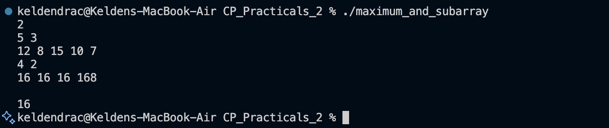

# Problem 2 — Maximum AND Subarray

## Problem Summary
Given an array of N integers, find the **maximum bitwise AND value** among all subarrays of length exactly K.

## Algorithm Explanation
1. Use a **greedy bit-by-bit approach** starting from the **MSB (bit 30) down to LSB (bit 0)**.
2. Maintain `maxAnd` as the current best AND value found so far.
3. For each bit position from high to low:
   - Create a `candidate = maxAnd | (1 << bit)` (try setting this bit in the result).
   - Check all K-length subarrays to see if any achieves this candidate value.
   - If yes, update `maxAnd = candidate` and continue; otherwise, skip this bit.
4. This greedy approach works because if a higher bit can be set, we should set it (contributes more to the final value).

## Time Complexity
- **31 bits × (N - K + 1) subarrays × K elements per subarray** = **O(31 · N · K)** ≈ **O(N · K)**

## Space Complexity
- **O(N)** for storing the array

## Screenshot

## Reflection
This problem taught me the power of **bit manipulation with greedy strategies**. Initially, I thought of checking all subarrays naively in O(N · K), but the hint about MSB-to-LSB checking revealed a smarter approach. The key insight is that AND operations only turn bits OFF (never ON), so once we've found subarrays achieving certain bits, we can greedily try to add higher bits. This ensures we find the maximum possible AND value efficiently.

