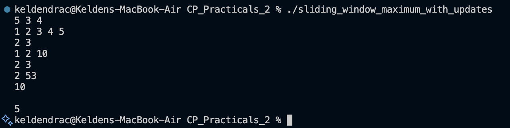

# Problem 4 — Sliding Window Maximum with Updates

## Problem Summary
Given an array and a window size K, process two types of queries:
- **Type 1**: Update an element to a new value
- **Type 2**: Find the maximum element in a sliding window ending at index i

## Algorithm Explanation
1. Store the array in a dynamic vector.
2. For each query:
   - **Type 1 (Update)**: Simply set `arr[pos] = val`.
   - **Type 2 (Max Query)**: Iterate through the window `[max(0, i - k + 1), i]` and find the maximum value.
3. The window is defined as elements from index `i - k + 1` to `i` (inclusive).

## Time Complexity
- **Per update query**: **O(1)**
- **Per max query**: **O(K)**
- **Total for Q queries**: **O(Q · K)** in the worst case

## Space Complexity
- **O(N)** for the array

## Advanced Optimization
For better performance on frequent queries, a **Segment Tree** or **Sparse Table** could maintain range maximums after updates in O(log N) or O(log N) per query.

## Screenshot

## Reflection
This problem combines dynamic updates with range queries. The straightforward approach is to recompute the maximum for each query, which works well for moderate Q and K. I learned that this is a foundation for more advanced data structures like Segment Trees. The trade-off between update and query time complexity is an important concept in competitive programming: simple approaches are faster to code and sufficient for many constraints, while advanced structures are necessary only when constraints are tight.

