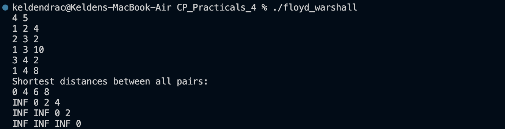
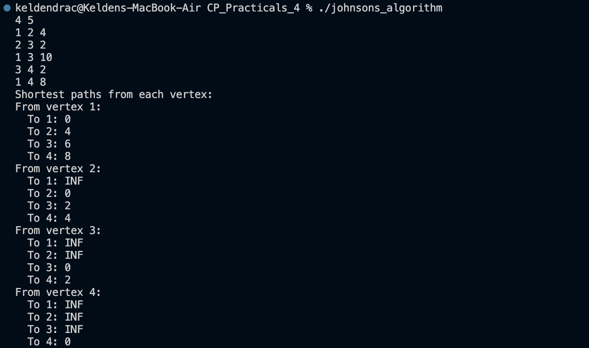
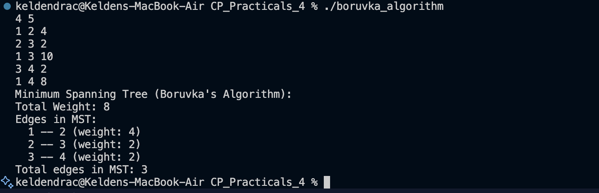

# CP Practicals 4 - Advanced Graph Algorithms

Implementations of **3 fundamental graph algorithms** used for computing shortest paths and minimum spanning trees. These algorithms are essential for competitive programming and real-world applications in networking, logistics, and optimization.

## Table of Contents

1. [Floyd-Warshall Algorithm](#problem-1-floyd-warshall-algorithm)
2. [Johnson's Algorithm](#problem-2-johnsons-algorithm)
3. [Boruvka's Algorithm](#problem-3-boruvas-algorithm)

---

## Problem 1: Floyd-Warshall Algorithm

**Problem Summary:**  
Compute the **shortest paths between all pairs of vertices** in a weighted directed graph. The graph can contain negative edge weights but must not have negative cycles.

**Key Features:**
- All-pairs shortest path computation
- Handles negative edge weights
- Can detect negative cycles
- Simple DP approach with O(n³) time complexity

**Algorithm:** Dynamic Programming with three nested loops  
**Time Complexity:** O(n³)  
**Space Complexity:** O(n²)  

**Best For:**
- Dense graphs
- When n ≤ 500
- Need all-pairs distances
- Graph contains negative weights

**Screenshot:**  

**Files:** [`floyd_warshall.cpp`](floyd_warshall.cpp) | [`floyd_warshall_analysis.md`](floyd_warshall_analysis.md)

---

## Problem 2: Johnson's Algorithm

**Problem Summary:**  
Compute the **shortest paths between all pairs of vertices** more efficiently for **sparse graphs** with negative edge weights (but no negative cycles).

**Key Features:**
- Combines Bellman-Ford and Dijkstra
- Reweights edges to eliminate negative weights
- Better than Floyd-Warshall for sparse graphs
- Detects negative cycles via Bellman-Ford

**Algorithm:** Bellman-Ford + Dijkstra + Reweighting  
**Time Complexity:** O(n · m + n² log n) sparse: O(n² log n)  
**Space Complexity:** O(n + m)  

**Best For:**
- Sparse graphs with negative weights
- Space-constrained problems
- When 100 ≤ n ≤ 10,000 with m << n²
- Need theoretical optimization

**Screenshot:**  

**Files:** [`johnsons_algorithm.cpp`](johnsons_algorithm.cpp) | [`johnsons_algorithm_analysis.md`](johnsons_algorithm_analysis.md)

---

## Problem 3: Boruvka's Algorithm

**Problem Summary:**  
Find the **Minimum Spanning Tree (MST)** of a weighted undirected graph—the subset of edges with minimum total weight connecting all vertices without cycles.

**Key Features:**
- Component-based edge selection
- Highly parallelizable
- Logarithmic phases (each phase halves components)
- Works with weighted undirected graphs

**Algorithm:** Phase-based component merging with Union-Find  
**Time Complexity:** O(m log n) or O(m · α(n)) with efficient DSU  
**Space Complexity:** O(n + m)  

**Best For:**
- Distributed and parallel computing
- Finding MST efficiently in general case
- When parallelization is available
- Large graphs on distributed systems

**Screenshot:**  

**Files:** [`boruvka_algorithm.cpp`](boruvka_algorithm.cpp) | [`boruvka_algorithm_analysis.md`](boruvka_algorithm_analysis.md)

---

## Algorithm Comparison

### All-Pairs Shortest Path

| Algorithm | Time Complexity | Space | Negative Weights | Use Case |
|-----------|-----------------|-------|------------------|----------|
| Floyd-Warshall | O(n³) | O(n²) | Yes | Dense graphs, n ≤ 500 |
| Johnson's | O(n² log n) sparse | O(n + m) | Yes | Sparse graphs, n ≤ 10K |
| Dijkstra (n times) | O(n · m log n) | O(n + m) | ❌ No | Dense graphs, no negatives |

### Minimum Spanning Tree

| Algorithm | Time Complexity | Space | Parallelizable |
|-----------|-----------------|-------|-----------------|
| Boruvka's | O(m log n) | O(n + m) | High |
| Kruskal's | O(m log m) | O(m) | ❌ Low |
| Prim's | O((m + n) log n) | O(n + m) | ⚠️ Medium |

---

## Key Concepts

### 1. **All-Pairs Shortest Path Problem**
- Find shortest distance between every pair of vertices
- Floyd-Warshall: Works with negative edges, O(n³)
- Johnson's: Better for sparse graphs, combines multiple algorithms

### 2. **Dynamic Programming (Floyd-Warshall)**
- Process intermediate vertices k = 1 to n
- Build up solutions using vertices 1 to k
- Optimal substructure ensures correctness

### 3. **Reweighting Technique (Johnson's)**
- Use Bellman-Ford to compute potentials h[v]
- Reweight edges: w'(u,v) = w(u,v) + h[u] - h[v]
- All weights become non-negative
- Shortest paths preserved: clever optimization!

### 4. **Greedy Algorithm (Boruvka's)**
- Repeatedly find minimum outgoing edge per component
- Add edges to MST if they connect different components
- Union-Find tracks component membership
- Logarithmic phases guarantee efficiency

### 5. **Union-Find (Disjoint Set Union)**
- Efficient component tracking
- Path compression: O(α(n)) amortized per operation
- Union by rank: Keeps tree shallow
- Essential for Boruvka's and Kruskal's

---

## Problem-Solving Strategy

### Choose Floyd-Warshall when:
1. Problem states "all-pairs shortest path"
2. n ≤ 500 (O(n³) is acceptable)
3. Graph may have negative edges
4. Need simple, straightforward implementation
5. Implementation time is limited

### Choose Johnson's when:
1. "All-pairs shortest path" + sparse graph
2. n is moderate (100-10K)
3. Memory/space is a concern
4. Graph has negative edges
5. Need theoretical optimal complexity

### Choose Boruvka's when:
1. Problem asks for MST/spanning tree
2. Distributed or parallel system available
3. Want elegant mathematical approach
4. Teaching/learning parallelizable algorithms
5. Part of larger system using Boruvka's

---

## Submission Checklist

For each algorithm, the following files are included:
- `algorithm_name.cpp` - C++ implementation
- `algorithm_name_analysis.md` - Detailed complexity and strategy analysis
- Input/Output examples in code comments

---

## Learning Outcomes

After studying these algorithms, you will understand:

1. **Floyd-Warshall**: Dynamic programming on graphs, matrix-based algorithms
2. **Johnson's**: Algorithm composition, reweighting technique, trade-offs in complexity
3. **Boruvka's**: Greedy algorithms, component-based thinking, parallelization
4. **Union-Find**: Efficient disjoint set data structure, path compression, union by rank
5. **Graph Algorithm Design**: When to use which algorithm based on problem constraints

---

## Real-World Applications

### Floyd-Warshall
- Network routing protocols
- Transitive closure computation
- Game AI pathfinding

### Johnson's Algorithm
- Sparse network analysis
- Database query optimization
- Distributed system routing

### Boruvka's Algorithm
- Network topology design
- Distributed algorithm coordination
- Image segmentation (min spanning forest)

---

## Reflection

These three algorithms represent **different paradigms in algorithm design**:

**Floyd-Warshall** is a **DP masterpiece**—simple, elegant, and demonstrates how three nested loops can solve a complex problem. Its O(n³) complexity is inherent to the problem, not due to algorithm inefficiency.

**Johnson's Algorithm** showcases **algorithm composition**—combining Bellman-Ford's power with Dijkstra's speed through the clever reweighting technique. It's a reminder that optimization sometimes means combining existing techniques rather than inventing new ones.

**Boruvka's Algorithm** is often overlooked but demonstrates **component-based thinking** and **parallelization opportunities**. In an era of distributed computing, it deserves renewed appreciation for its elegant phase-based approach.

These algorithms collectively illustrate a key principle: **understanding multiple solutions to the same problem is crucial**. No single algorithm dominates all scenarios—context matters. Performance depends on graph structure (dense vs. sparse), problem constraints (n, m), and execution environment (sequential vs. parallel).

The journey from Floyd-Warshall to Johnson's to Boruvka's shows the progression of algorithmic optimization: from simple and general to complex and specialized. In competitive programming, recognizing which algorithm fits which problem is as important as knowing the algorithms themselves.
