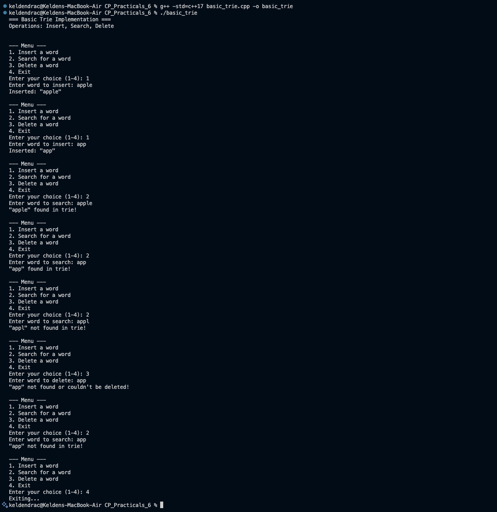

# Problem 1 — Basic Trie Algorithm

## Problem Summary
Implement a Trie (prefix tree) data structure to efficiently store and retrieve strings. Support insert, search, and delete operations on a collection of words while maintaining the trie structure integrity.

## Algorithm Explanation

### Trie Structure
A Trie is a tree-based data structure where:
- Each node contains a map/array of child nodes (one for each character)
- Each node has a boolean flag `isEndOfWord` to mark if a complete word ends at that node
- Root node is typically empty

### Insert Operation
1. Start at root node
2. For each character in the word:
   - If a child node for this character exists, move to it
   - Otherwise, create a new child node and move to it
3. Mark the final node as `isEndOfWord = true`

### Search Operation
1. Start at root node
2. For each character in the word:
   - If a child node for this character doesn't exist, return false
   - Move to the child node
3. Return true only if the final node has `isEndOfWord = true`

### Delete Operation
1. Use DFS to traverse to the end of the word
2. If word not found, return false
3. Mark `isEndOfWord = false` at the final node
4. Recursively remove nodes that:
   - Have no children AND
   - Are not the end of another word

## Time Complexity
- **Insert:** O(m) where m = length of word
- **Search:** O(m) where m = length of word
- **Delete:** O(m) where m = length of word

## Space Complexity
- **O(ALPHABET_SIZE × N × m)** where:
  - ALPHABET_SIZE = size of character set (26 for lowercase letters)
  - N = number of words
  - m = average word length
- **Overall: O(N × m)** in practice

## Screenshot

## Key Features
- Support for insert, search, and delete operations
- Prefix-based queries
- Automatic duplicate handling
- Memory-efficient for words with common prefixes

## Reflection
The Trie data structure elegantly solves the string storage and retrieval problem. Unlike hash tables that treat strings as atomic units, tries break them down character by character, enabling efficient prefix queries. The delete operation demonstrates the importance of maintaining structural integrity while removing nodes. This data structure is fundamental in many text processing applications like autocomplete, spell checking, and IP routing.
