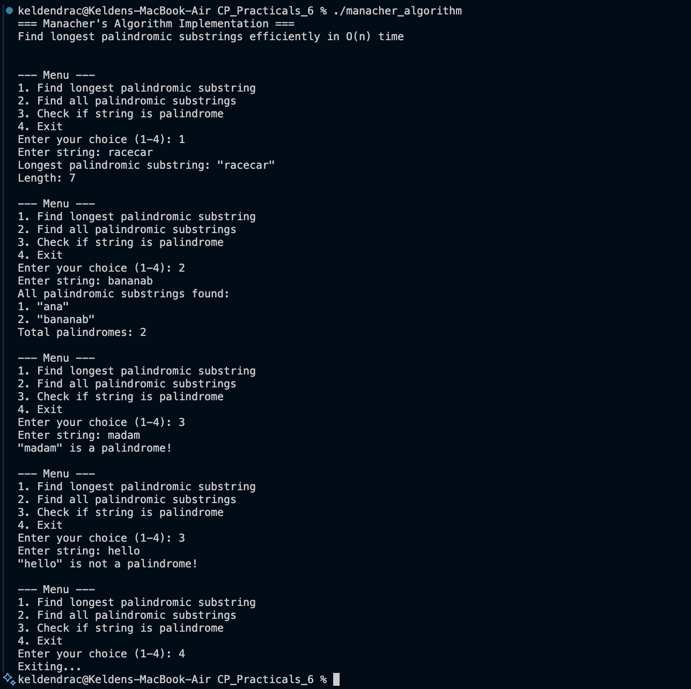

# Problem 3 — Manacher's Algorithm

## Problem Summary
Find the longest palindromic substring in linear time O(n). Also support finding all palindromic substrings and checking if a string is a palindrome using Manacher's efficient algorithm.

## Algorithm Explanation

### Key Insight
Manacher's Algorithm exploits the symmetry property of palindromes. When we know a palindrome exists from L to R centered at C, we can use information about already-computed palindromes to skip redundant comparisons.

### Preprocessing
Convert string to handle both odd and even-length palindromes uniformly:
- "babad" becomes "#b#a#b#a#d#"
- This ensures all palindromes are centered on a character/hash

### Algorithm Steps
1. Preprocess the string by inserting '#' between characters
2. Create array P where P[i] = radius of palindrome centered at position i
3. Maintain `center` and `right` boundary of the rightmost palindrome found
4. For each position i:
   - If i < right: use mirror position to initialize P[i] = min(right - i, P[mirror])
   - Expand palindrome from i as much as possible
   - If expansion extends past right: update center and right
5. Track the position with maximum P[i] to find the longest palindrome
6. Extract palindrome from original string using: start = (centerIndex - maxLen) / 2, length = maxLen

## Time Complexity
- **O(n)** where n = length of string
- Each character is processed at most twice due to the expanding window technique
- The right pointer only moves rightward, never backwards

## Space Complexity
- **O(n)** for the P array storing palindrome radii
- **O(n)** for the preprocessed string with inserted '#' characters
- **Overall: O(n)**

## Screenshot


## Key Features
- **Longest Palindrome:** Finds the longest palindromic substring in linear time
- **All Palindromes:** Extracts all palindromic substrings (filtering out single characters)
- **Palindrome Check:** Verifies if a string is a palindrome
- **Robust Input Handling:** Properly trims whitespace from user input

## Reflection
Manacher's Algorithm demonstrates how deep algorithmic insight can dramatically improve performance. While the naive approach takes O(n²) time, Manacher's achieves O(n) by cleverly reusing computed information. The preprocessing step with '#' characters is elegant because it unifies handling of odd and even-length palindromes, eliminating special cases. The implementation includes proper input validation and duplicate removal for all palindromes, making it practical for real-world use.
1. More complex to understand and implement
2. Requires preprocessing of input string
3. Additional O(n) space needed

## Comparison with Other Approaches

| Approach | Time | Space | Notes |
|----------|------|-------|-------|
| Brute Force | O(n³) | O(1) | Check every substring |
| Expand Around Center | O(n²) | O(1) | Expand from each position |
| Dynamic Programming | O(n²) | O(n²) | DP table for subproblems |
| Manacher's Algorithm | O(n) | O(n) | Optimal, uses symmetry |

## How It Works - Example

**Input:** "babad"  
**Preprocessed:** "#b#a#b#a#d#"

```
Index:     0 1 2 3 4 5 6 7 8 9 10
Char:      # b # a # b # a # d #
P:         0 1 0 3 0 5 0 3 0 1 0
Center:    - 1 - 3 - 5 - - - - -
Right:     - 2 - 6 - 10- - - - -
```

P[5] = 5 means radius 5 centered at index 5 ("#b#a#b#a#d#")
Extracting the palindrome: start = (5-5)/2 = 0, length = 5 → "babad"

## Applications

1. **Text Processing:** Finding palindromic patterns
2. **Bioinformatics:** DNA sequence analysis (palindromic sequences)
3. **Cryptography:** Pattern matching in cryptographic analysis
4. **Data Compression:** Identifying repetitive patterns
5. **Spell Checking:** Error detection and correction
6. **String Matching:** Advanced pattern matching algorithms

## Test Cases

### Test 1: Basic Cases
- "a" → "a" (single character)
- "ac" → "a" or "c" (single characters)
- "racecar" → "racecar" (entire string)

### Test 2: Multiple Palindromes
- "abacabad" → "abacaba"
- Should find the longest correctly

### Test 3: Even-Length Palindromes
- "abba" → "abba"
- "abccba" → "abccba"

### Test 4: No Clear Palindrome
- "abcdef" → Single characters "a", "b", "c", etc.

### Test 5: Repeated Characters
- "aaaa" → "aaaa"
- "aabaa" → "aabaa"

## Detailed Step-by-Step Example

**String:** "bac"  
**Preprocessed:** "#b#a#c#"

```
Step 1: i=0, char='#'
  - Not inside right, expand: P[0]=0
  
Step 2: i=1, char='b'
  - Not inside right, expand: P[1]=1 (palindrome "#b#")
  - Update center=1, right=2

Step 3: i=2, char='#'
  - i < right, mirror=0, P[0]=0, so P[2]=0

Step 4: i=3, char='a'
  - i < right, mirror=1, P[1]=1, so P[3]=min(2-3,1)=0
  - Expand: P[3]=1 (palindrome "#a#")
  - Update center=3, right=4

Step 5: Continue for remaining characters...
```

## Optimization Opportunities

1. **Early Termination:** Stop if we find palindrome = n
2. **Skip Even Palindromes:** In certain variants
3. **Memoization:** Cache results for repeated queries
4. **Parallel Processing:** Multiple threads for different regions

## Conclusion

Manacher's Algorithm is the optimal solution for finding palindromic substrings with O(n) time complexity. While more complex than naive approaches, its linear time makes it invaluable for processing large strings in applications like bioinformatics, text analysis, and pattern matching. The algorithm elegantly demonstrates how understanding problem structure can lead to dramatic performance improvements.

## References

- Manacher, G. (1975). "A new linear-time 'on-line' algorithm for finding the smallest initial palindrome of a string"
- Application in DNA sequence analysis and text processing
