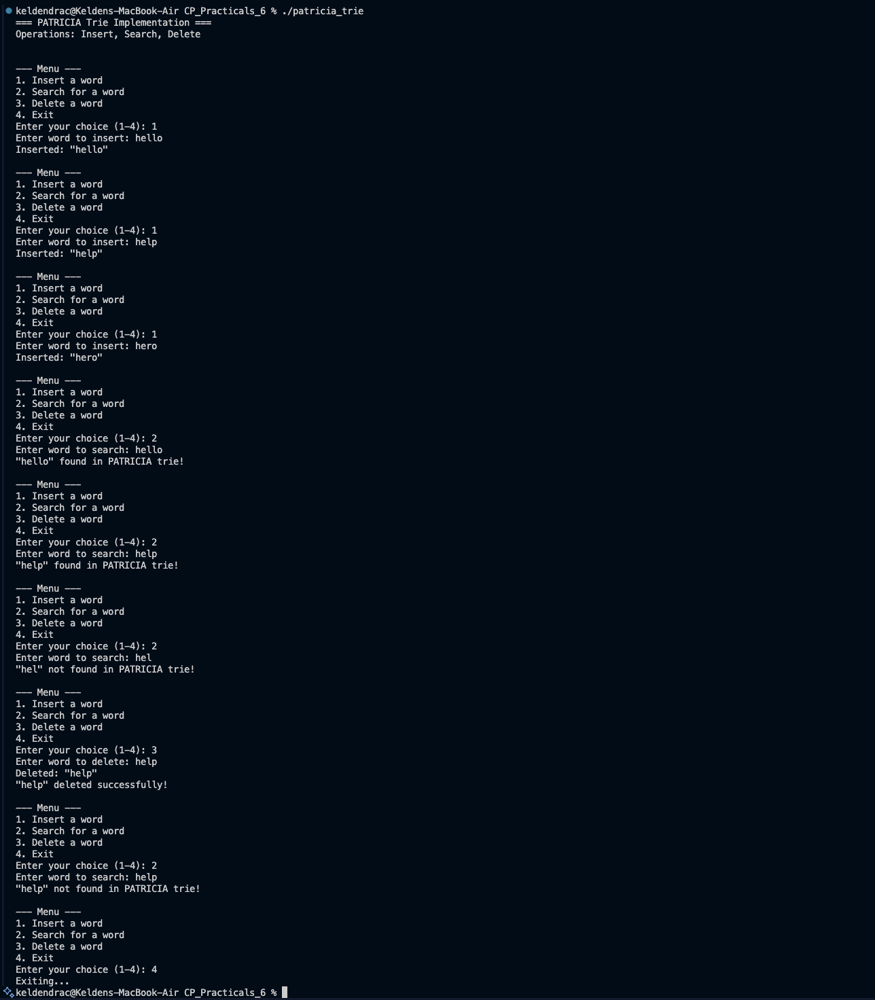

# Problem 2 — PATRICIA Trie

## Problem Summary
Implement a PATRICIA Trie (Practical Algorithm to Retrieve Information Coded in Alphanumeric), a space-optimized variant of a trie that compresses chains of single children into single edges, significantly reducing memory overhead while maintaining O(m) search time.

## Algorithm Explanation

### PATRICIA Trie Structure
PATRICIA tries compress a regular trie by:
- Storing edge labels (multiple characters) instead of single characters per node
- Only creating new nodes at branching points where the alphabet diverges
- Eliminating chains of nodes with single children

### Key Differences from Regular Trie
1. **Regular Trie:** One node per character
2. **PATRICIA Trie:** One node per branch point
3. **Edge Labels:** Contains strings instead of single characters
4. **Reduced Memory:** Fewer nodes for common prefix structures

### Insert Operation
1. Start at root, follow edge labels that match the word prefix
2. If an edge label partially matches:
   - Split the edge into two parts
   - Create a new branch node
   - Attach old and new branches
3. If word is consumed, mark node as word-ending
4. If word remains, create new edge with remaining characters

### Search Operation
1. Start at root, match word against edge labels
2. If an edge label matches the remaining word:
   - Move to the target node
   - Continue searching
3. If an edge label partially matches:
   - Word is not in the trie
4. Return true only if entire word is matched and node is word-ending

### Delete Operation
1. Find the node corresponding to the word
2. Mark the node as no longer word-ending
3. If node has only one child and is not shared:
   - Merge edges to reduce node count
   - Clean up redundant nodes

## Time Complexity
- **Insert:** O(m) where m = length of word
- **Search:** O(m) where m = length of word
- **Delete:** O(m) where m = length of word

## Space Complexity
- **O(N)** where N = total number of characters in all stored words
- Significantly better than regular trie for large prefix-sharing scenarios
- Much better space efficiency due to edge compression

## Screenshot

## Key Features
- Space-optimized storage of words with common prefixes
- Efficient insertion and searching
- Proper edge splitting and merging during modifications
- Clean node removal when words are deleted

## Reflection
The PATRICIA Trie is a masterclass in algorithmic optimization. By recognizing that unary chains (single-child nodes) waste space, we can compress them into edge labels. This is particularly valuable when storing large dictionaries or word lists where many words share long prefixes. While the implementation is more complex than a regular trie, the space savings and practical efficiency make it the algorithm of choice for high-performance applications like IP routing and database indexing.
